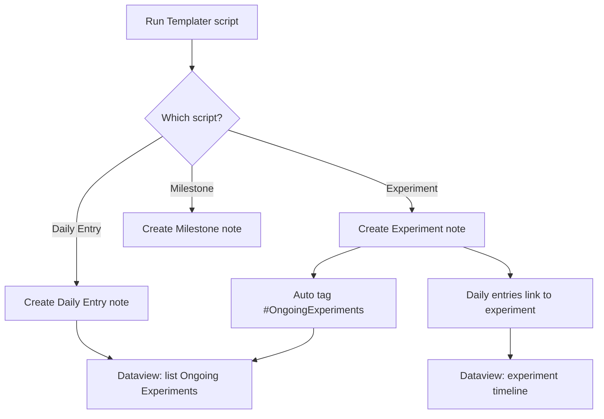

# Obsidian Lab Notebook Template

An Obsidian vault template built around experiments, daily entries, and milestones.
Includes Templater scripts and Dataview blocks to auto-link notes and surface context.

## Requirements

- Obsidian
- Templater plugin
- Dataview plugin

## Folder layout

```
LabNote/
  Daily Entries/
  Experiments/
  MileStones/
```

## Templates

- `templates/daily_entry_template.md`
- `templates/experiment_template.md`
- `templates/milestone_template.md`

## Scripts

- `scripts/daily_entry_script.md`: creates a daily entry note from the template.
- `scripts/experiment_script.md`: creates a dated experiment note and links it.
- `scripts/milestone_script.md`: creates a monthly milestone note.
- `scripts/dataview_block.md`: shows archived experiments and linked daily entries.

## How it auto-propagates



## Setup

1) Copy the `templates/` files into your vault template folder.
2) Copy the `scripts/` files into your Templater scripts folder.
3) Ensure the folder layout matches the paths used in the scripts.
4) Use the scripts to create new notes.

## Notes

- Tags are case sensitive. This template uses `#OngoingExperiments` and `#ArchivedExperiments`.
- If your vault uses different folders, update the folder paths in the scripts.
