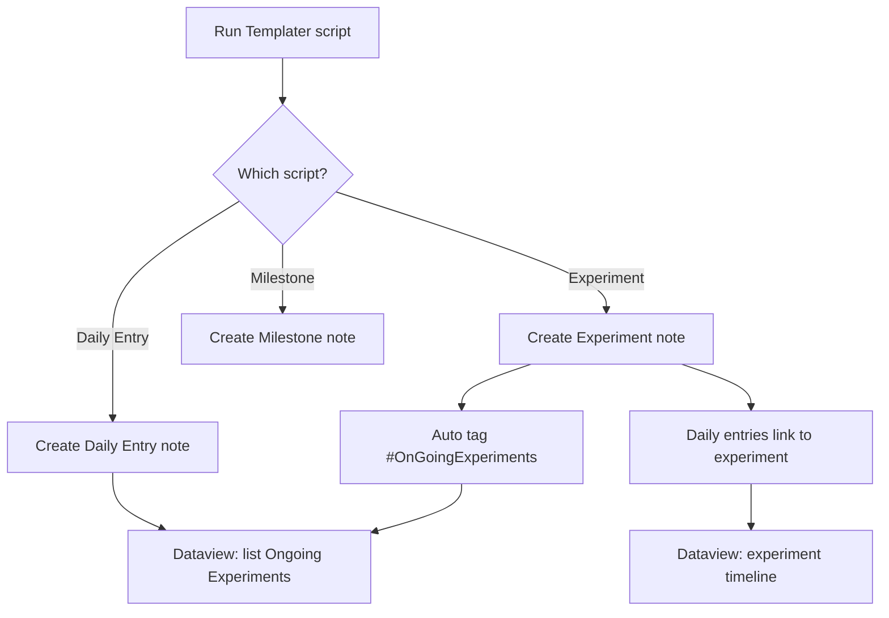

# Obsidian Lab Notebook Template

An Obsidian vault template built around experiments, daily entries, and milestones.
Includes Templater scripts and Dataview blocks to auto-link notes and surface context.

## Requirements

- Obsidian
- Templater plugin
- Dataview plugin

## Folder layout

```
LabNote/
  Daily Entries/
  Experiments/
  MileStones/
```

## Templates

- `templates/daily_entry_template.md`
- `templates/experiment_template.md`
- `templates/milestone_template.md`

## Scripts

- `scripts/daily_entry_script.md`: opens today's daily note if it exists, otherwise creates it and lists ongoing experiments.
- `scripts/experiment_script.md`: creates an experiment note with an auto-generated code and optional custom title.
- `scripts/milestone_script.md`: renames and moves the current note into the monthly milestone entry, then inserts the template.
- `scripts/dataview_block.md`: shows archived experiments and linked daily entries.

## How it auto-propagates


```mermaid
flowchart TD
  A[Run Templater script] --> B{Which script?}
  B -->|Daily Entry| C[Create Daily Entry note]
  B -->|Experiment| D[Create Experiment note]
  B -->|Milestone| E[Create Milestone note]
  C --> F[Dataview: list Ongoing Experiments]
  D --> G[Auto tag #OnGoingExperiments]
  G --> F
  D --> H[Daily entries link to experiment]
  H --> I[Dataview: experiment timeline]
```

## Setup

1) Copy the `templates/` files into your vault template folder.
2) Copy the `scripts/` files into your Templater scripts folder.
3) Ensure the folder layout matches the paths used in the scripts.
4) Use the scripts to create new notes.

## Notes

- Tags are case sensitive. This version uses `#OnGoingExperiments` and `#DailyEntries`.
- Experiment notes keep a `Code` frontmatter field and are surfaced in daily notes through links.
- If your vault uses different folders, update the folder paths in the scripts.
